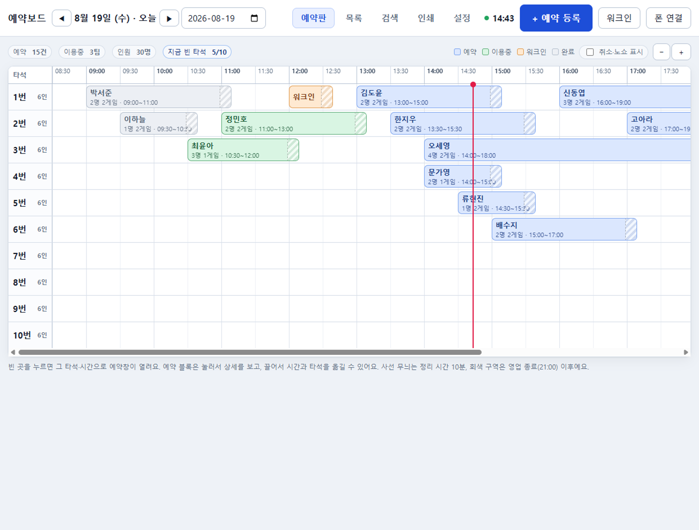
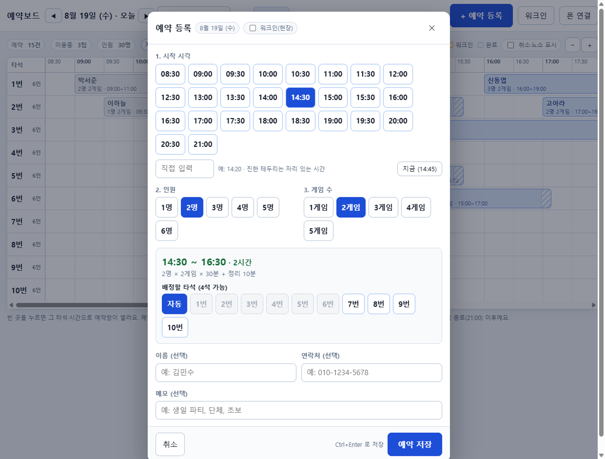
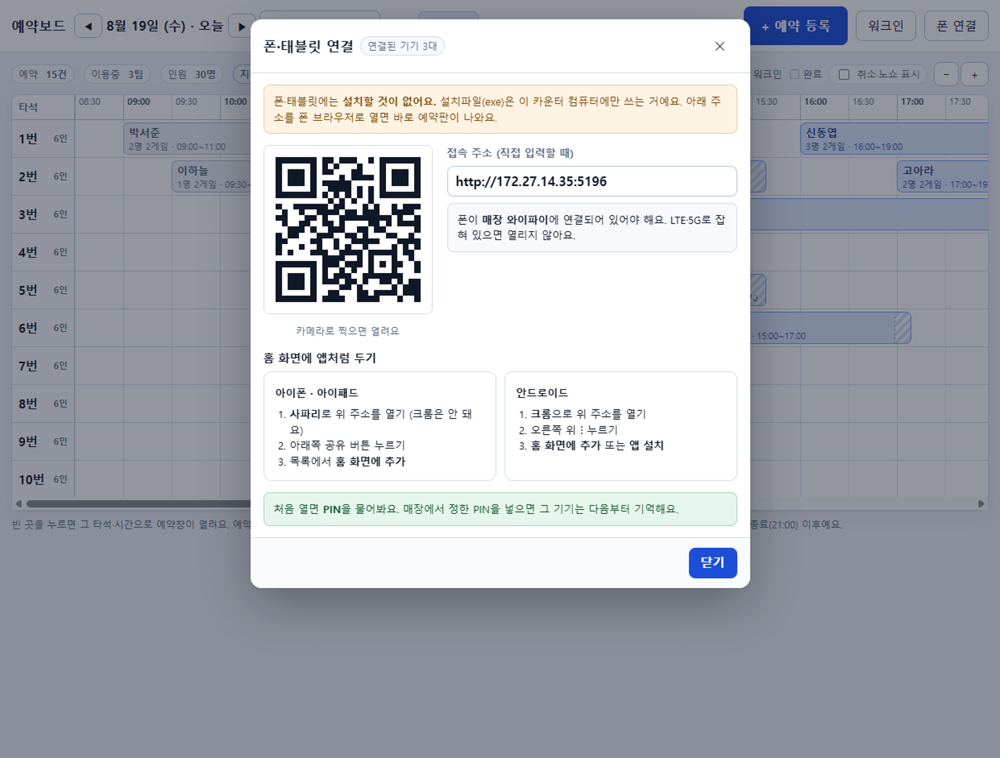
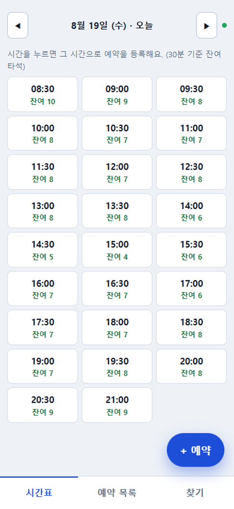
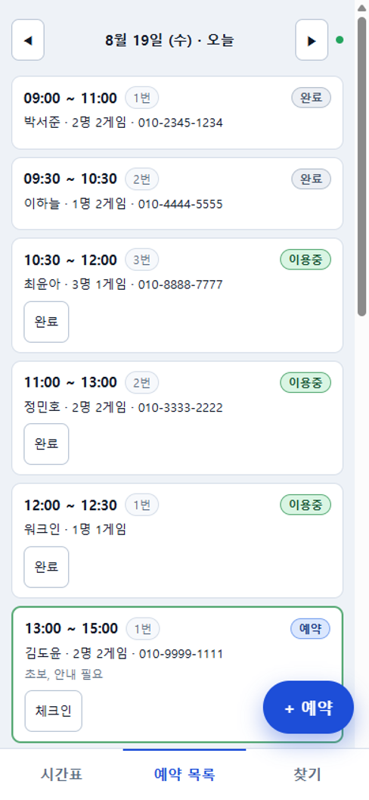
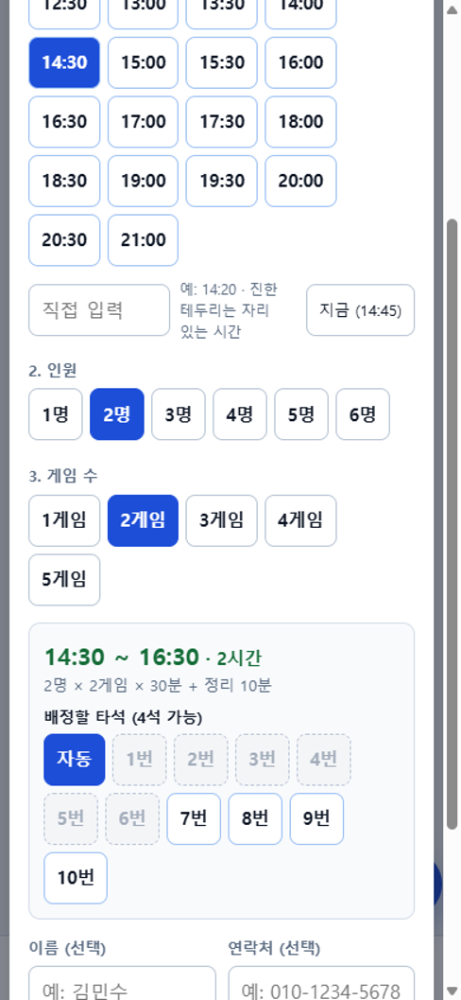
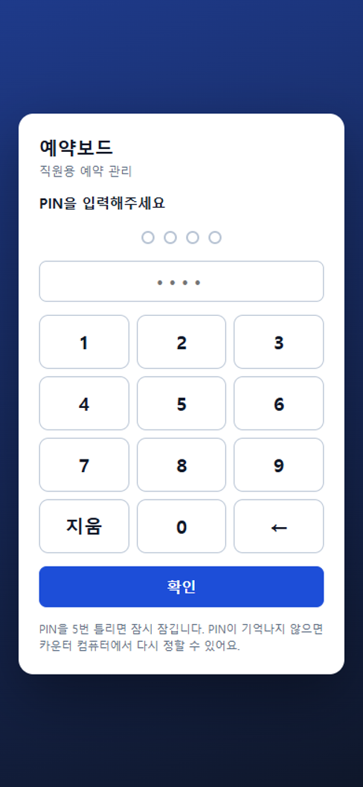

# 예약보드 (YeyakBo)

**스크린골프 매장 카운터용 예약 관리 프로그램**

전화 예약의 종료 시각 자동 계산 · 타석 중복 예약 차단 · 인터넷 불필요 · 서버비 0원


[](https://github.com/minyoung0303/screengolf-reservation-board/actions/workflows/ci.yml)



---

## 개요

| 항목 | 내용 |
|---|---|
| 대상 | 스크린골프 매장 직원 (카운터 전화 응대) |
| 문제 | 수기 장부 예약 관리 → 종료 시각 오산 → 타석 중복 예약 발생 |
| 해결 | 소요시간 자동 계산 + 저장 단계 중복 차단 + 마감 시 대안 시간 제시 |
| 환경 | Windows 10 PC 1대 + 직원 폰·태블릿 (브라우저 접속) |
| 배포 | 설치파일(.exe) 1개. 인터넷·클라우드·구독료 없음 |
| 상태 | 매장 실사용 중. 설치파일은 [Releases](https://github.com/minyoung0303/screengolf-reservation-board/releases/latest) 에서 받으실 수 있습니다 |

---

## 문제 정의

전화 응대 중 직원의 암산 부담 2가지.

| 부담 | 내용 |
|---|---|
| 종료 시각 계산 | "2시에 2명 2게임" → 소요 2시간 → 16:00 종료 |
| 빈자리 대조 | 10개 타석 × 하루 12시간 30분 중 해당 구간 공실 확인 |

- 통화 중 수 초 내 처리 필요 → 계산 지연 → **예약 중복 발생**
- 핵심 과제는 화면 설계가 아닌 **소요시간 계산 + 중복 판정**
- 성공 기준: **전화 응대 3초 내 "가능" 또는 "대안 시간" 응답 가능 여부**

---

## 해결 방식

### 1. 소요시간 자동 계산

```
소요시간 = 인원 × 게임 수 × (인원별) 1인 1게임 시간
점유시간 = 소요시간 + 정리 여유 시간
```

- 기본값: 1인 1게임 30분, 정리 10분
- 2명 2게임 → 이용 2시간, 점유 2시간 10분
- 인원별 1인 1게임 시간 개별 설정 지원 (인원 증가 시 실제 소요 단축되는 매장 대응)
- 개별 예약 수동 조정 (+30분 / −30분 / +1게임)

### 2. 중복 예약 차단

```sql
-- 동일 타석 시간 겹침 판정 (끝과 시작이 맞닿는 경우는 겹침 아님)
기존.시작 < 신규.종료  AND  기존.종료 > 신규.시작
```

- 검사 + 저장을 **단일 트랜잭션**으로 처리 → 카운터·태블릿 동시 저장 시 1건만 성공
- 화면 검증에 의존하지 않고 **저장 단계에서 차단**
- 시간 표현은 **자정 기준 분(정수)** 통일 (`08:30` → `510`) → 소수점·시간대 오류 원천 제거
- 취소·노쇼는 삭제 대신 상태 전환 → 기록 보존 + 자리 재개방

### 3. 마감 시 대안 시간 제시

- 빈 타석 없을 경우 저장 차단 + 근접 가능 시각 3개 자동 산출
- 직원의 응대 문장을 화면이 대신 준비

```
14:00에는 10개 타석이 모두 차 있어요.
이 시간은 어떠세요?  [13:00 3석]  [16:30 5석]  [17:00 8석]
```

---

## 기능

| 구분 | 기능 |
|---|---|
| 예약판 | 타석 × 시간 타임라인, 현재 시각선, 상태별 색상, 빈칸 클릭 등록, 드래그 이동 |
| 예약 처리 | 등록 · 수정 · 취소 · 노쇼 · 체크인 · 완료 · 연장 · 워크인(현장 손님) |
| 조회 | 오늘 목록, 이름·전화 뒷자리 검색, 시간대별 잔여 타석 요약 |
| 설정 | 타석 수·이름·정원, 영업시간, 마지막 입장, 인원별 소요시간, 정리시간, 보관 기간 |
| 안전장치 | 실행 시 자동 백업(최근 30개), 백업 폴더 지정, 예약표 A4 인쇄, 변경 이력 기록 |
| 폰·태블릿 | 브라우저 접속, PIN 잠금, 실시간 동기화, 접속용 QR 코드 생성 |

---

## 화면

| 예약 등록 | 폰·태블릿 연결 |
|---|---|
|  |  |

- 입력 3단계(시간 → 인원 → 게임 수) 후 종료 시각·배정 가능 타석 즉시 표시
- 시간 버튼 색상으로 해당 조건의 가능 여부 사전 표시
- 이름·연락처 미입력 저장 허용 (통화 중 시간 선점 후 보완)

| 폰 시간표 | 폰 예약 목록 | 폰 예약 등록 | PIN 잠금 |
|---|---|---|---|
|  |  |  |  |

> 화면 내 예약 정보는 전부 시범용 가상 데이터 (`scripts/demo.mjs` 생성)

---

## 구조

```
   [카운터 PC]  Electron 앱 = 화면 + HTTP 서버 + 데이터(SQLite 파일 1개)
        │
     매장 와이파이 (인터넷 불필요)
        │
  ┌─────┴─────┐
[직원 폰]   [태블릿]      브라우저 접속 · PIN 잠금 · SSE 실시간 동기화
```

- 카운터 PC 1대를 데이터 기준점으로 고정 → 월 비용·인터넷 장애·계정 관리 제거
- 트레이드오프: 해당 PC 전원 종료 시 폰 접속 불가

```
shared/     시간·타입 정의 (서버·화면 공용)
server/     DB · 예약 엔진(계산·충돌·대안) · 인증 · API · HTTP 서버 · 백업
electron/   메인 프로세스 · preload
src/        React 화면 (예약판 · 예약 등록 · 폰 화면 · 설정 · 인쇄)
scripts/    빌드 · 자동 점검 · 시범 데이터 · 화면 캡처 · PDF 변환
```

### 기술 선택 근거

| 항목 | 선택 | 근거 |
|---|---|---|
| 앱 | Electron | 설치파일 단일 배포 + 동일 프로세스에서 폰 접속용 서버 구동 |
| 데이터 | **`node:sqlite`** (Node 24 내장) | 네이티브 모듈 컴파일 제거 → 타 PC 설치 시 빌드 도구 요구 없음 |
| 서버 | `node:http` | 프레임워크 미사용, 라우터 자체 구현 60줄 → 번들 실패 지점 제거 |
| 실시간 동기화 | SSE (`EventSource`) | 단방향 전파에 충분. WebSocket 라이브러리 불필요 |
| 화면 | React + TypeScript + Vite | 타임라인 UI 구현 속도 |
| QR 코드 | `qrcode-generator` | 빌드 시 번들. 외부 API 호출 없음 |
| 패키징 | electron-builder (NSIS) | 코드 서명 미사용 → 비용 0, 첫 실행 경고 1회 |

**런타임 의존성 0개.** `package.json`에 `dependencies` 항목이 아예 없음. 배포물은 번들된 `dist` 뿐.
설치 시점에 인터넷·컴파일러 불필요.

---

## 접근 제어

매장 와이파이를 손님과 공용하는 환경 → **PIN 잠금 필수 적용**

| 항목 | 정책 |
|---|---|
| 카운터 PC | loopback 접속으로 판별 → PIN 없이 사용 (물리적 접근 통제 전제) |
| 폰·태블릿 | PIN 확인 후 사용. 기기별 세션 토큰 발급, 30일 미사용 시 만료 |
| PIN 저장 | scrypt 해시. 숫자 4~8자리. `0000`·`1234` 등 취약 패턴 거부 |
| 시도 제한 | 5회 실패 1분 → 10회 5분 → 15회 30분 잠금 (IP 기준) |
| PIN 변경·재설정 | 카운터 PC에서만 가능. 변경 시 전체 원격 세션 해제 |
| CSRF | 상태 변경 요청의 Origin 검사로 외부 사이트 요청 차단 |
| 개인정보 | 이름·연락처만 수집. 보관 기간 경과 시 자동 삭제. 외부 전송 없음 |

**한계 명시:** 매장 내부 HTTP 통신은 암호화되지 않음. 동일 와이파이에서 통신 관찰이 가능한 상대에게는
PIN 노출 가능. 중요 비밀번호를 PIN으로 사용하지 않도록 매뉴얼에 명시.

---

## 검증

`npm run smoke` — 실제 서버 구동 후 API 호출 방식, **80개 항목 전수 통과**

| 영역 | 검증 항목 |
|---|---|
| 계산 | 2명 2게임 120분 / 1명 2게임 60분 / 4명 2게임 240분 / 설정 변경 반영 |
| 경계 | 정리시간 직후(16:10) 시작 허용, 정리시간 침범(16:00) 시작 거부 |
| 중복 | 동일 타석 겹침 거부, 전 타석 마감 시 409 + 대안 시간 반환 |
| 상태 | 취소 후 자리 재개방, 되살릴 때 재검사, 삭제 후 404 |
| 동시성 | 동일 자리 5회 동시 저장 시도 → 1건만 성공 |
| 인증 | PIN 형식·시도 제한·권한 분리(폰에서 PIN 변경 거부), CSRF 차단 |
| 배포 | 폰 홈 화면 설정 파일 및 아이콘 4종 전달, 형식(MIME) 확인 |

추가 검증

- 타입 검사 2개 프로젝트(화면·서버) 통과
- 구버전 데이터 파일 → 신버전 실행 시 예약·설정·PIN 유지 확인 (업그레이드 경로)
- 백업 파일 복원 절차 실측 확인

### 자동 실행

위 세 가지(타입 검사 · 자동 점검 80항목 · 문서 점검)를 push 와 pull request 마다
GitHub Actions 가 `windows-latest` + Node 24 에서 실행합니다 ([`ci.yml`](.github/workflows/ci.yml)).
배포 대상과 같은 OS 에서 검증하려고 Windows 러너를 씁니다.

---

## 설치

매장에서 쓰실 분은 이 항목만 보시면 됩니다. 개발 도구를 설치할 필요는 없습니다.

### 1. 설치파일 받기

[**최신 릴리스 다운로드**](https://github.com/minyoung0303/screengolf-reservation-board/releases/latest) → `YeyakBo-Setup-1.0.3.exe`

설치파일은 저장소에 포함되어 있지 않습니다. 용량이 큰 파일을 커밋에 쌓지 않기 위해
릴리스 페이지에 따로 올립니다. 태그를 올릴 때마다 GitHub Actions 가 Windows 에서 빌드해
자동으로 첨부합니다 ([`release.yml`](.github/workflows/release.yml)).

### 2. 설치하기

| 단계 | 화면에 뜨는 것 | 하실 일 |
|---|---|---|
| 1 | 파일 실행 | 받은 `YeyakBo-Setup-1.0.3.exe` 를 두 번 클릭 |
| 2 | "Windows 의 PC 보호" 경고 | **추가 정보** → **실행** |
| 3 | 설치 위치 선택 | 그대로 두고 **설치** |
| 4 | 방화벽 알림 | **개인 네트워크 허용** 에 체크 |
| 5 | 앱의 PIN 설정 화면 | 숫자 4~8 자리 입력 |

2단계 경고는 코드 서명 인증서를 쓰지 않아서 뜹니다. 인증서는 연 수십만 원이 들고
매장 한 곳에 쓰는 프로그램에는 과한 비용이라 넣지 않았습니다. 바이러스가 아니라
"만든 사람이 돈을 내고 신원을 증명하지 않았다"는 뜻입니다. 빌드 과정은
[`release.yml`](.github/workflows/release.yml) 에 전부 공개되어 있습니다.

4단계를 건너뛰면 **폰·태블릿 접속이 안 됩니다.** 이 프로그램은 카운터 PC 가 매장 와이파이 안에서
작은 서버 역할을 하기 때문에, 방화벽이 막으면 폰에서 접속할 수 없습니다.
놓치셨다면 Windows 방화벽 설정에서 `예약보드` 의 개인 네트워크를 허용하시면 됩니다.

설치가 끝나면 기본값 상태로 바로 쓸 수 있습니다 (타석 10개, 08:30~21:00, 1인 1게임 30분, 정리 10분).
자세한 사용법은 [설치 · 사용 매뉴얼](docs/manual/설치_매뉴얼.md) 에 있습니다.

---

## 소스에서 빌드

Node 24 이상 필요 (`node:sqlite` 사용)

```bash
git clone https://github.com/minyoung0303/screengolf-reservation-board.git
cd screengolf-reservation-board
npm install
npm run dist        # Windows 설치파일 생성 → release/YeyakBo-Setup-1.0.3.exe
```

아이콘(`build/icon.png`, `public/`)은 저장소에 포함되어 있어 별도 생성이 필요 없습니다.

```bash
npm run dev         # Vite + Electron 개발 모드
npm run build       # 번들 (dist/main, dist/renderer)
npm run smoke       # 자동 점검 (API 80개 항목)
npm run typecheck   # 타입 검사
npm run check:docs  # 문서 인코딩·링크 점검
npm run demo        # 시범 데이터 생성 (임시 폴더, 실제 데이터와 분리)
npm run icon        # 아이콘 재생성 (build/, public/)
npm run shots       # 문서용 화면 캡처 (docs/images)
npm run docs        # 매뉴얼 → PDF 변환
```

---

## 문서

| 문서 | 대상 | 내용 |
|---|---|---|
| [기획서](docs/기획서.md) | 개발·기획 | 요구사항 도출, 계산 규칙, 데이터 구조, 일정·비용 산정, 리스크 |
| [설치 · 사용 매뉴얼](docs/manual/설치_매뉴얼.md) · [PDF](docs/manual/설치_매뉴얼.pdf) | 매장 관리자 | 설치, 일상 사용, 백업·복구, 버전 업그레이드, 문제 해결 |
| [폰 · 태블릿 접속 방법](docs/manual/폰_태블릿_접속방법.md) · [PDF](docs/manual/폰_태블릿_접속방법.pdf) | 직원 | 1장 안내 (QR 접속, 홈 화면 추가) |
| [PIN 안내](docs/manual/PIN_안내.md) · [PDF](docs/manual/PIN_안내.pdf) | 매장 관리자 | PIN 정책, 공유·변경·분실 대응 |

매뉴얼 3종은 비개발자 독자를 대상으로 의도적으로 대화체 유지.

---

## 다른 업종 적용

"자리 × 시간" 단위 예약 업종에 설정 변경만으로 적용 가능.
타석 이름·개수·정원, 영업시간, 인원별 소요시간, 정리시간 전부 설정값.

- 스크린야구 · 볼링 · 당구
- 합주실 · 스터디룸 · 독서실
- 촬영 스튜디오 · 공유주방 · 세미나실

---

## 라이선스

**GNU Affero General Public License v3.0** (AGPL-3.0-only) — 전문 [`LICENSE`](LICENSE)

Copyright (C) 2026 ANBambi (Minyoung Lee)

| 행위 | 조건 |
|---|---|
| 원본을 그대로 설치해 매장에서 사용 | 자유. 아무 의무 없음 |
| 사용 · 복제 · 학습 · 상업적 이용 | 자유 |
| 수정본 배포 | 수정본 전체를 동일한 AGPL-3.0 으로 공개 |
| 수정본을 네트워크로 서비스 (SaaS 등) | 이용자에게 해당 소스 제공 (§13) |

즉 이 코드를 고쳐서 남에게 제공하려면 고친 소스도 함께 공개해야 합니다.
매장에서 쓰는 직원·관리자에게는 어떤 의무도 발생하지 않습니다.

### 상업 라이선스

소스 공개 없이 이 코드를 자사 제품에 포함하거나, 재판매·구독형 서비스로 운영하려는 경우
저작권자와 별도 계약으로 상업 라이선스를 받을 수 있습니다 (듀얼 라이선스).

문의: [GitHub Issues](https://github.com/minyoung0303/screengolf-reservation-board/issues)

### 상표

`예약보드`, `YeyakBo` 이름과 아이콘은 라이선스 적용 대상이 아니며 저작권자가 보유합니다.
포크한 결과물에는 다른 이름을 사용해 주세요.

---

## Summary (English)

**YeyakBo** — an offline-first reservation board for Korean screen-golf shops.

- Computes booking end time from party size and game count
- Blocks overlapping bookings inside a single database transaction
- Suggests nearest available slots when the requested time is full
- Serves the same board over the shop's Wi-Fi for staff phones and tablets (PIN-locked, no app install)
- Zero runtime dependencies: Electron + Node 24 built-in `node:sqlite`, plain `node:http`, SSE
- No cloud, no subscription, single `.exe` installer
